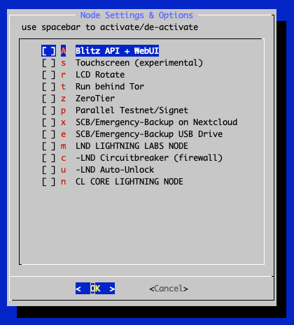
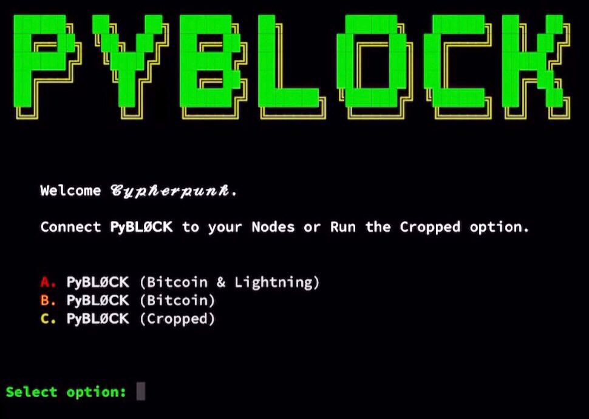

# SSH Menu

Once the Blockchain is synced you will enter the SSH Main Menu:

All options on the main menu will be explained below in the feature documentation.

_OK ..
so from here on out, your RaspiBlitz is ready to play with._

If you need an idea of what the most basic next steps to experience Lightning would be:

- Fund on-chain wallet
- Open a channel
- Make a payment

If you would prefer to do this from a web browser with a dashboard UI, instead of an SSH terminal, go to `SERVICES`, activate the `RTL Webinterface`, and after install you will find a new menu option for RTL in the SSH main menu - it will give you all the information so that you can now open the RTL web interface in your browser.

### Feature Documentation

These are the features available through the RaspiBlitz SSH menus.
They have the goal to offer some basic/fallback functionality & configurations.
More complex or user-friendly tasks are best to be done with wallets, apps and scripts you connect to your Lightning Node via [APIs](#interface--apis) - because you have a full Bitcoin- and Lightning-Node on the RaspiBlitz.

So let's take a look at the SSH main menu in detail:

#### INFO: Raspiblitz Status Screen

This is the screen that gets displayed on the LCD/display.
It\'s useful to call in a remote situation from SSH if you don\'t have your RaspiBlitz next to you, or if you want to copy+paste your nodeID or make a screenshot.

_It's not automatically updating.
It's just for one-time info._

- [Why is my bitcoin IP on the display red?](../faq/faq.md#why-is-my-bitcoin-ip-on-the-display-red)
- [Why is my node address on the display red?](../faq/faq.md#why-is-my-node-address-on-the-display-red)
- [Why is my node address on the display yellow (not green)?](../faq/faq.md#why-is-my-node-address-on-the-display-yellow-not-green)

#### LIGHTNING (Basic Node Management)

Under `LND/Core Lightning Wallet options` you will find some basic tools for managing your Lightning node.
These are very simplified in the RaspiBlitz SSH menu for learning purposes.
For more advanced management of your Lightning node see additional apps under `SERVICES`.

##### FUNDING: Fund your on-chain Wallet

Before you can open channels with other nodes you need to put some coins in your on-chain wallet (managed by your lightning software).
Use this option to generate an address to send funds to.

_Reminder: RaspiBlitz is still experimental software.
With funding your lightning node you accept the risk of losing funds.
So just play with small amounts - something in the area of 20 EUR/USD should be enough to make your first experiences.
Also, it's a good privacy practice to [coinjoin your coins](https://bitcoin-only.com/privacy) before sending them to any Lightning Network wallet._

You can fund it multiple times - starting with small amounts first to test.
Your lightning node will always generate a different address, but all funds you send will get into the same LND on-chain wallet.

##### CONNECT: Connect to a Peer

Before you can open a channel with another node on the network, you need to connect this node as a peer to your node.

Opening a channel with a peer is just optional.
Having another node as peer helps your node to receive information about the lightning network through the gossip protocol.
It will help your node to find better routes through the network.

##### CHANNEL: Open a Channel with Peer

To open a payment channel with another node, you can use this option.

Find interesting nodes to open channels with through online directories like [1ML.com](https://1ml.com/) or join the RaspiBlitz NodeManager telegram group to meet people to open channels with: [https://t.me/raspiblitz](https://t.me/raspiblitz)

Bear in mind that this option will open a public channel that can be seen by everyone in the network and chosen by them as part of their payment route.
This is good if you want to route payments.
If you do not want to route payments for others, you can use a so-called "private" (i.e. unannounced) channel which others cannot use as part of their payment route.
To do this you must go to the command line and open the channel with the `-private` option.

_This is just a very basic shell script.
For more usability, try the RTL Webinterface (under Services) or connect a (mobile) wallet with your RaspiBlitz._

##### SEND: Pay an Invoice/PaymentRequest

Pay an invoice through lightning.

_This is just a very basic shell script.
For more usability try the RTL Webinterface (under Services) or connect a (mobile) wallet with your RaspiBlitz._

If you are looking for something to test payments with Lightning, why not [donate some satoshis to RaspiBlitz development](https://raspiblitz.org/#donation)? Thanks :)

##### RECEIVE: Create Invoice/PaymentRequest

Create an invoice to send to someone for a service to be paid through lightning.

_This is just a very basic shell script.
For more usability try the RTL Webinterface (under Services) or connect a (mobile) wallet with your RaspiBlitz._

##### NAME: Change name of your Node

Here you can change the alias name of your node as it is shown as part of the Lightning network.

##### CLOSE ALL: Closing all open Channels

_This option is only available if you have channels open._

With this feature you can close down all open channels and get the funds locked up in those channels returned to your on-chain wallet.

You may choose to force-close some channels where the channel partner is no longer reachable.
Keep in mind that when you force-close a channel it can take a much longer time until your funds are available again through your on-chain wallet.

##### CASHOUT: Remove Funds from on-chain Wallet

Use if you want to remove all funds from the RaspiBlitz.

#### SETTINGS: Basic Settings of RaspiBlitz

Here you will find basic settings for your RaspiBlitz:

Activate/Deactivate settings with the space bar and then select 'OK' to activate changes.
You can find more details about those options (top to down):

##### Touchscreen (experimental)

Your RaspiBlitz has an LCD that is touchscreen capable.
You can switch on this new feature that is still in development.

It will enable 4 touch buttons on the left hand side of the screen.

- Info - to be defined later
- Node - shows the nodeID/uri as QR code (used to open channels from mobile wallets)
- Invoice - creates an Invoice-QR code that can be used for payments
- Off - Shutdown or Restart the RaspiBlitz

Please mind that the touchscreen is still experimental and with recent changes is missing certain UI fixes. This might take still until a later version where the touchscreen is planned for a refactor/rewrite.

##### LCD Rotate

If you switch this on you can rotate the LCD of your RaspiBlitz 180 degrees.
This might make sense if you have a special case or wall mount.

##### Run behind Tor

You can run both your Bitcoin & Lightning nodes, as well as additional apps, behind a Tor hidden service.
This replaces your clearnet IP address with an `.onion` style hidden service address.

Running your node as a hidden service has some benefits:

- You don't publish your IP address so it's much harder to resolve your real name and location.
- You tunnel through the NAT of your router and make your Bitcoin and Lightning nodes reachable (i.e. allow _incoming_ connections) from all other Tor nodes on the network(s).
- By using a Tor address it's possible to move the node to a different IPv4 address and keep the existing (i.e. previously opened and funded) channels functional.

But this can also come with the following side effects:

- Some Mobile wallets don't support connecting to RaspiBlitz over Tor yet.
- Lightning nodes that don't run Tor cannot reach you (like behind NAT).

_Using Tor hides your IP address but will possibly increase the [time](https://twitter.com/SeverinAlexB/status/1442138426740981761) it will take for your node to route a payment.
Setting up over clearnet will give you a lower response time when routing payments but your IP address will be freely available to the rest of the network like the node [tippin.me](https://1ml.com/node/03c2abfa93eacec04721c019644584424aab2ba4dff3ac9bdab4e9c97007491dda).
If you need to be private and/or don't want to doxx your home network then Tor might be the option for you.
However if privacy isn't something you need and/or want, or you are trying to set up a service that your node is the back end for, then clearnet might be more advantageous choice._

To try it out, just switch on the service - you can deactivate it later on if it's not working for you.

##### Parallel Testnet/Signet

It is very convenient to learn and test to play around in a "sandbox" environment.
RaspiBlitz allows this through activating "testnet & signet" that run in parallel to the "mainnet".

Once activated you will see an additional option in the SSH Main Menu that will give you more options to operate the Testnet & Signet.

To get some bitcoin testnet coins, you can use "faucets" from different places on the internet, here are a few links:

- https://coinfaucet.eu/en/btc-testnet/
- https://testnet-faucet.mempool.co/
- https://kuttler.eu/en/bitcoin/btc/faucet/
- https://faucet.lightning.community/

You can read more about TESTNET and Bitcoin faucets here: https://kuttler.eu/code/bitcoin-testnet-blockchain-size-in-2020/

##### ZeroTier

With ZeroTier you can add your RaspiBlitz to a software defined network - see for details: https://en.wikipedia.org/wiki/ZeroTier

##### LND LIGHTNING LABS NODE

This needs to be switched on to see the sub-settings options for LND.
If switched on it means the LND lightning node implementation is installed and running on your RaspiBlitz - it can run in parallel to Core Lightning.
If activated you will find an additional option in the SSH Main Menu that offers you more options for operating the LND node.
Also under `SERVICES` some apps might only be available if LND is activated.

##### LND Channel Autopilot

The channel autopilot feature of LND allows an "autopilot" to automatically use around half of your on-chain (i.e. bitcoin) funds, if available, to open new channels with other lightning nodes.
The autopilot can be very useful to get started transacting swiftly if you're a newbie, as channels are opened for you.
It is very likely that after a while, once you will have a hang of the concept of channels and how they work, that you will not need channels autopilot any more.

Beware that currently, toggling the Channels Autopilot setting will trigger a reboot of your RaspiBlitz.
It is not a problem per se, just a bit of waste of time [Improvement request #1953](https://github.com/rootzoll/raspiblitz/issues/1953)

##### LND Accept Keysend

Keysend is a feature of LND that allows your node to accept payments without having created an invoice first.
This needs to be activated, for example, if you want to use your nodes for experimental messaging over the Lightning Network (see RaspiBlitz MOBILE apps like SendMany).

##### LND Circuitbreaker (Firewall for LND)

Not all peers in the Lightning network are necessarily friendly.
Circuitbreaker is a background service you can activate that acts similarly to a firewall to protect your node.
For details see: https://github.com/lightningequipment/circuitbreaker/blob/master/README.md

##### LND Auto-Unlock

The RaspiBlitz will automatically unlock the LND wallet upon every start.

This feature is based on [https://raspibolt.org/bonus/lightning/auto-unlock.html#bonus-guide-auto-unlock-lnd-on-startup].

It can be activated under "Services" -> "Auto-unlock LND".
We recommend that it be turned on when DynamicDNS is used.
If there is a public IP change on your router LND restarts automatically, and without Auto-Unlock it will stay inactive/unreachable until you manually unlock it which could be annoying.

- [When using Auto-Unlock, how much security do I lose?](../faq/faq.md#when-using-auto-unlock-how-much-security-do-i-lose)

##### StaticChannel/Emergency-Backup on Nextcloud

See [below on this README](../setup/software-setup/2_basic.md#backup-for-on-chain---channel-funds) for your Backup options when it comes to securing your funds against accidental loss.
Storing the encrypted Static Channel Backup file to your Nextcloud account is an easy and secure way to do this.

Nextcloud is an open-source project to host your own files: https://en.wikipedia.org/wiki/Nextcloud - in its basics it's an open DropBox replacement... but can do much much more.
You can run it yourself or use a hosted Nextcloud server.
Find free Nextcloud providers here to sign up: https://nextcloud.com/signup/

##### StaticChannel/Emergency-Backup on USB Drive

You can connect a small extra USB drive to your RaspiBlitz (choose a small one up to 32GB, don't use second HDD or SSD here as that would drain too much power from the RaspiBlitz).
That USB drive will then be used to store your latest StaticChannelBackup, just in case your HDD encounters an error.

##### StaticChannel/Emergency-Backup per SCP/SSH to other server

See [SCP Backup Target](../setup/software-setup/2_basic.md#b-scp-backup-target) for details on how to setup static channel backups using SCP.

##### CORE LIGHTNING NODE

This needs to be switched on to see the sub-settings options for Core Lightning.
If switched on it means the c-lighting node implementation is installed and running on your RaspiBlitz - it can run in parallel to LND.
If activated you will find an additional option in the SSH main menu that offers you more options to operate the Core Lightning node.
Also under `SERVICES` some apps might only be available if Core Lightning is activated.

For more details on this lightning node implementation go to the [Core Lightning FAQ page](../faq/cl.md).

##### CL CLBOSS Automatic Node Manager

CLBOSS is an automated manager for Core Lightning routing payments nodes.
CLBOSS is effectively a bunch of heuristics modules wired together to a regular clock to continuously monitor your node.

Find more info at the [CLBOSS GitHub](https://github.com/ZmnSCPxj/clboss).

##### CL Wallet Encryption

You can protect your Core Lightning wallet by encrypting it with your password C.
On every system restart you will need to decrypt/unlock with that password before Core Lightning can use the wallet.
This adds some physical security for example in case your node get stolen.

#### SERVICES: Activate/Deactivate Services

The RaspiBlitz offers further Services, Apps and configuration (scroll down to see all options in the RaspiBlitz) also some Apps & Services might just be available if you installed/activated LND or Core Lightning:

Activate/Deactivate service selection with the space bar and then select 'OK' to trigger Install/Uninstall.
You can find more details about those options below (top to bottom):

##### Electrum Rust Server

Enables a user to run their own Electrum server on the RaspiBlitz.
The server indexes the entire Bitcoin blockchain from the copy saved locally on your HDD/SSD, and the resulting index enables fast queries for any given user wallet.
This allows the user to keep real-time track of their balance and transaction history using any wallet which speaks the Electrum Protocol, for example the [Electrum wallet](https://electrum.org).

Since Electrum Rust server runs on the user's own machine there is no need for the wallet to communicate with external Electrum servers, thus preserving the privacy of addresses and balances.

By contrast, if you use your Trezor Hardware Wallet with the trezor.io web-wallet, it will tell their third party server your public keys - connecting them with your IP.
Now you can use your Trezor with the Electrum Wallet by talking to your _own_ Electrum Server, preserving your privacy.

Learn how you can use Electrum with your own Server over Tor:

[More Details on Service](https://github.com/romanz/electrs)

After install, you will see a new `ELECTRS` option in the SSH main menu - it will give you all the information you need to start using it.

##### BTCPayServer

[BTCPay Server](https://github.com/btcpayserver) is a self-hosted, open-source cryptocurrency payment processor.
It's secure, private, censorship-resistant and free.

Find all details on how to use the BTCPay Server on your RaspiBlitz in this great tutorial: https://coincharge.io/en/btcpay-server-on-the-raspiblitz/

After install, you will see a new `BTCPAY` option in the SSH main menu - it will give you all the information you need to start using it.

##### BTC-RPC-Explorer

BTC-RPC-Explorer is a blockchain explorer website you can run on your own RaspiBlitz.
See an example running on: https://btc-explorer.com

[Details on Service](https://github.com/janoside/btc-rpc-explorer)

After install, you will see a new `EXPLORE` option in the SSH main menu - it will give you all the information you need to start using it.

##### Specter Desktop

Bitcoin Core has a very powerful command line interface and a wonderful daemon.
Using pre-signed bitcoin transactions (PSBT) and [Hardware Wallet Interface](https://github.com/bitcoin-core/HWI) (HWI), it can also work with hardware wallets.
At the moment it is very Linux-focused.
The same applies to multi-signature setups.

The goal of the Specter Desktop wallet is to make a sub and user-friendly GUI around Bitcoin Core, focusing on multi-signature setups with air-gapped hardware wallets like Trezor, Ledger, COLDCARD or the Specter-DIY.

After install, you will see a new `SPECTER` option in the SSH main menu - it will give you all the information you need to start using it.

##### Mempool Space

Mempool Space is the fully featured visualizer, explorer, and API service running on mempool.space

[Details on Service](https://github.com/mempool/mempool)

After install, you will see a new `MEMPOOL` option in the SSH main menu - it will give you all the information you need to start using it.

##### JoinMarket

JoinMarket is software to create a special kind of bitcoin transaction called a CoinJoin transaction.
Its aim is to improve the confidentiality and privacy of bitcoin transactions.

A CoinJoin transaction requires other people to take part.
The right resources (coins) have to be in the right place, at the right time, in the right quantity.
This isn't a software or tech problem, it's an economic problem.
JoinMarket works by creating a new kind of market that would allocate these resources in the best way.

For more details see [here](https://github.com/JoinMarket-Org/joinmarket-clientserver).

After install, you will see a new `JMARKET` option in the SSH main menu - it will give you all the information you need to start using it.

##### Download Bitcoin Whitepaper

Extract the original Bitcoin Whitepaper as PDF directly from the blockchain of your node.

##### Bitcoinminds.org local on RaspiBlitz

make the BitcoinMinds.org educational link collection locally available on your RaspiBlitz.

##### RTL Webinterface

The RTL Webinterface is available as an LND & Core Lightning control dashboard you can run in your browser with a nice GUI.
It offers much more control over your Lightning node than the RaspiBlitz SSH menus.
It's recommended to give it a try.

Get all the details on how to manage your channels with RTL in this video:

Read an Intro-Tutorial to RTL: https://medium.com/@suheb.khan/how-to-ride-the-lightning-447af999dcd2

Feedback is welcome by the RTL programmer: https://github.com/ShahanaFarooqui/RTL

After install, you will see a new `RTL` option in the SSH main menu - it will give you all the information you need to start using it.

##### ThunderHub

A Lightning Node Manager WebUI - similar to RTL, but just available for LND.

[Details on Service](https://www.thunderhub.io)

After install, you will see a new `THUB` option in the SSH main menu - it will give you all the information you need to start using it.

##### Lightning Terminal (LIT) with loop, pool & faraday

Lightning Terminal (LiT) is a browser-based interface for managing channel liquidity on LND.
It bundles the former single tools called loop, pool & faraday with an easy to use browser interface.

[Details on Service](https://github.com/lightninglabs/lightning-terminal#lightning-terminal-lit)

After install, you will see a new `LIT` option in the SSH main menu - it will give you all the information you need to start using it.

##### LNbits

LNbits is a very simple server that sits on top of your Lightning Wallet.

It can be used together with IP2Tor to provide:

- Lightning Paper Vouchers (Plugin: LNURLw)
- Merchant Onboarding (Plugin: TPOS)

You can also develop your own extensions on it.

[Details on Service](https://github.com/arcbtc/lnbits/blob/master/README.md)

After install, you will see a new `LNBITS` option in the SSH main menu - it will give you all the information you need to start using it.

##### Balance of Satoshi

Balance of Satoshi gives you enhanced commands for working with LND balances.

[Details on Service](https://github.com/alexbosworth/balanceofsatoshis/blob/master/README.md)

After install, you will see a new `BOS` option in the SSH main menu - it will give you all the information you need to start using it.

##### PyBlock

Dashboard Bitcoin information program (needs LND).

https://github.com/curly60e/pyblock/blob/master/README.md

##### Channel Tools (chantools)

This tool provides helper functions that can be used to rescue funds locked in LND channels in case LND itself cannot run properly any more.
Also some other useful command line features.

https://github.com/guggero/chantools

##### Sphinx Relay Server

The Sphinx App allows chat over the Lightning Network with LND and ties into the idea of [Podcasting 2.0](https://u.today/father-of-podcasting-integrates-bitcoin-lightning-into-his-app).
To use the mobile app with your own RaspiBlitz you need to install the [Sphinx Relay Server](https://github.com/stakwork/sphinx-relay/blob/master/README.md).

After install, you will see a new `SPHINX` option in the SSH main menu - it will give you all the information you need to start using it.

##### Core Lightning RTL Webinterface

The same RTL as above but running with Core Lightning node.
Can run parallel to the LND version.
See details above.

##### Core Lightning Sparko Webwallet

WalletUI & HTTP-RPC bridge for Core Lightning

https://github.com/fiatjaf/sparko#the-sparko-plugin

##### Core Lightning Spark Webwallet

WalletUI for Core Lightning with BOLT12 offers

https://github.com/shesek/spark-wallet#progressive-web-app

#### SYSTEM: Monitoring & Configuration

Different options to monitor & edit system services.

#### CONNECT: Connect Apps & Credentials

This feature should support connecting your RaspiBlitz to a mobile wallets or other apps.

##### MOBILE: Mobile Wallet Apps (Smartphone)

At the moment the following mobile wallets are supported - some are only available if LND or Core Lightning is activated:

- [Zeus (iOS/Android)](https://github.com/ZeusLN/zeus) (LND & Core Lightning)
- [Zap (iOS/Android)](https://www.zaphq.io/) (only LND)
- [Fully Noded (iOS over Tor)](https://apps.apple.com/us/app/fully-noded/id1436425586)
- [SendMany (Android)](https://github.com/fusion44/sendmany/blob/master/README.md) (only LND)
- [Sphinx Chat App (iOS/Android)](https://sphinx.chat/) (only LND)

Mobile wallets work as a remote control app for your RaspiBlitz.
First you need to install the apps on your phone - a QR code with the links to the app stores are displayed.
Then you need to `pair` them with your RaspiBlitz - also via a QR code displayed on the LCD.
If you run your RaspiBlitz without an LCD, there is the fallback option to display that QR code on the terminal as ASCII code (which might involve lowering your terminal's font size).

##### Electrum Rust Server Instructions

Information how to connect to Electrum Rust Server (if installed).

##### BTCPAY: Get the connection string for the BTCPay Server

To connect the payment processing BTCPay server to your Lightning node you find here the needed Connection string.

##### bitcoinRPC

If apps need access to the Bitcoin RPC service you can find this here.

##### BISQ: Use your node with BISQ

Here you can activate a hidden service for your bitcoin node so that it can be used for the decentralized exchange called BISQ.

##### EXPORT: Macaroons and TLS.cert

If you want to access your LND APIs (to connect apps and additional services) you need credential files that grant access (Macaroons & the TLS cert).

_Macaroons: Access Tokens that allow certain command executions on the LND node._
_TLS: Certificate to secure/encrypt communication with the LND node._

In this menu, you can reset, re-sync, or export them as a file or string so that you can import them to apps and additional services.

Here are the following export options to get the Macaroon and TLS files to be used in other apps and wallets:

###### SSH Download

SCP is a SSH-like command used to transfer files.
If we're able to SSH into the RaspiBlitz then using SCP to transfer files should also work.
If you choose this option, RaspiBlitz will print prepared SCP commands you can copy+paste to run in a second terminal.

This method is recommended to export to:

- [Zap Desktop Wallet](https://github.com/LN-Zap/zap-desktop)

###### Browser download

Opens an ad-hoc web server so that you can download the files in your local network through the browser.

_This is the least secure way to transfer those files - everybody in your local network has access to those file during download.
Remember with the Admin-Macaroon somebody could take over your node and spend all your funds.
Just use as last fallback._

###### Hex-String

The Macaroons and TLS.cert files can be copy+pasted as Hex-Strings from RaspiBlitz to any other app that supports that format.
If you choose this option, RaspiBlitz will print all the files for you as Hex-String to do so.

This method is recommended to export to:

- [Joule Browser Wallet](https://lightningjoule.com)

#### SUBSCRIBE: Subscription Services

The RaspiBlitz offers now also Subscriptions.
These might be free or paid third-party services.

Under `LIST my Subscriptions` you will always find the list of all your active subscriptions, to get more details or to `CANCEL` them.

At the moment, the following subscription services are available:

##### IP2TOR (paid)

IP2TOR is a tunnel service where you can run your RaspiBlitz anonymously behind TOR but you rent a port on a clearnet IP through which you can make services of your RaspiBlitz easy reachable for everybody on the internet.
You don't need to care about your local router or firewall settings.
You can pay for this service directly through Lightning from your RaspiBlitz as subscription.

At first you select what services of your RaspiBlitz you like to tunnel through a IP2TOR bridge.

You will get a list of available IP2TOR shops & bridge offerings.
Select `OK` on an IP2TOR bridge offering and you will see more details on it, such as how many satoshis the subscription will cost you.
Your node should be funded and have channels open already at this point.

If you choose `AGREE` on the details of a IP2TOR bridge offering the RaspiBlitz tries for you to setup the IP2TOR bridge.
If everything worked you will find now the subscription under `MAINMENU` > `SUBSCRIBE` > `LIST My Subscriptions` where you can cancel it again.

To try out the IP2TOR tunnel choose in `MAINMENU` the extra menu point of the Service you choose the bridge for and it should give you now an updated URL or try calling the API on the IP and Port that is displayed under the details of the subscription in the `LIST My Subscriptions` section.

##### HTTPS with LetsEncrypt (free)

If you want a web service, like BTCPay Server or LNbits, to be available to the outside internet (like with IP2TOR) people expect you to offer an HTTPS address so that the communication between the client and your RaspiBlitz is encrypted.
You could use the self-signed HTTPS certificate that RaspiBlitz is offering you, but this will give users Security Warnings in their browser and is not very user friendly.

That's where you can use a LetsEncrypt Subscription to get a free valid HTTPS certificate that is accepted without warning from almost all common browsers

Because you also need a domain name for that you will need to open a free account, the following are presently supported, would be good to add more with the help of the community:
[DuckDNS.org](https://www.duckdns.org)
[DYNU.com](https://www.dynu.com) (AT THE MOMENT NOT AVAILABLE)

When you create a new LetsEncrypt subscription, you will be asked for your subdomain on DuckDNS and the auth-token of your DuckDNS account.
Then RaspiBlitz tries to setup everything for you.
If everything worked, you will find the subscription under `MAINMENU` > `SUBSCRIBE` > `LIST My Subscriptions`, where you can cancel it at any time if you wish.

HTTPS can be a hairy topic, you can try using a SSL Checker to help you quickly diagnose problems with your SSL certificate installation: [www.sslshopper.com/ssl-checker.html](https://www.sslshopper.com/ssl-checker.html)

#### PASSWORD: Change Passwords

Change your passwords for security.

#### REPAIR: Options to test, repair and reset your RaspiBlitz

The `REPAIR` menu gives you options to check and reset your RaspiBlitz.

The options are explained in detail below:

##### SOFTWARE: Run Software Tests (DebugReport)

This will print out a lot of information that can be used to find software problems.

Use this if you want to report a software problem with your RaspiBlitz, so that others can have a look and help you better.

##### BACKUP-LND: Backup your LND data (Rescue-File)

This stops your RaspiBlitz and creates an LND-Rescue ZIP file that you can download via SCP to your laptop.
This can be used to move your LND id, wallet & channels to another RaspiBlitz.

_NOTICE: If you start your RaspiBlitz after this backup again the backup is outdated and using it can risk losing your channel funds._

##### RESET-LND: Delete LND & start a node/wallet

_THIS WILL DELETE ALL YOUR LND DATA AND CHANNEL FUNDS.
Use this only if you have closed all channels and removed all funds._

Use this option if you want to start with a fresh LND node id & wallet.

##### REPAIR-CL: Repair/Backup Core Lightning

Multiple options to repair/backup your c-lightning node:

##### MIGRATION: Migrate Blitz Data to new Hardware

This stops your RaspiBlitz and creates a Migration ZIP file you can download/export per SCP to your laptop.
This contains all the important data from your RaspiBlitz including LND, your Blitz configuration and also data from your installed apps.
Can be used to migrate your RaspiBlitz to a new hardware - for example if you want to replace the HDD with a SSD.
For details on how to import a Migration File [see here](/docs/setup/software-setup/basic#import-a-migration-file).

_NOTICE: If you start your RaspiBlitz after exporting the migration file again it is outdated and using it can risk losing your channel funds._

##### COPY-SOURCE: Offer your Blockchain to another RaspiBlitz for Setup

To expedite the setup process, you can connect another RaspiBlitz and copy over your blockchain data to it.
Your RaspiBlitz will be `offline` during that process and it can take between 4 to 6 hours.

Make sure both RaspiBlitzes are connected to the same local network.
During setup with the new RaspiBlitz, choose the `COPY` option to get the blockchain data and then select the source computer `RASPIBLITZ`.
Now you can choose the `COPY-SOURCE` option, enter the IP address of the _new_ RaspiBlitz and its Password A (not yours), after which the process should start automatically.

##### RESET-CHAIN: Delete Blockchain and Re-Download

Use this option if your blockchain data got corrupted.
It will keep your LND data.
You can even keep your channels open.
Just keep in mind that your Lightning node will appear offline to the network until you have re-downloaded the blockchain.

##### RESET-HDD: Delete HDD data but keep blockchain

_THIS WILL DELETE ALL YOUR LND DATA AND CHANNEL FUNDS.
Use this only if you have closed all channels and removed all funds._

Use this if you want to setup a fresh RaspiBlitz but don't want to re-download the blockchain.

##### RESET-ALL: Delete HDD completely & start fresh

_THIS WILL DELETE ALL YOUR LND DATA AND CHANNEL FUNDS.
Use this only if you have closed all channels and removed all funds._

Use this if you want to setup a fresh RaspiBlitz with an empty HDD.

##### DELETE-ELEC: Delete Electrum Index

If you had Electrum installed, you can use this option to make sure also the space consuming electrum index gets deleted to free up space.

##### DELETE-INDEX: Delete Bitcoin TX-Index

If you had the Bitcoin Transaction Index activated you can use this option to make sure that this extra space consuming index gets deleted as well to free up space.

#### UPDATE: Check/Prepare RaspiBlitz Update

The `UPDATE` menu gives you options to update your RaspiBlitz and some apps you might have installed.

The options are explained in detail:

_Please note that the RaspiBlitz does not support any form of automatic (over the air) updates.
This is to ensure that there can be no remote control of your node from a central server._

##### RELEASE: Update RaspiBlitz to a new Version

This is a common way to update your RaspiBlitz.
Choose this option to prepare your RaspiBlitz for a new SD card image containing the new version release.

##### PATCH: Patch RaspiBlitz code

With Patching you have now an easy way to sync your RaspiBlitz code/scripts with the official RaspiBlitz GitHub Repo or even your own forked GitHub Repo.
This is an option for people that report bugs and we like to offer them a quick script update (patch) between RaspiBlitz releases or for people who want to develop on the RaspiBlitz and sync code between their IDE, forked GitHub and their RaspiBlitz.

##### LND: Interim LND Update

Sometimes there is a new LND release that has some breaking changes that once you updated the LND database cannot be reversed (like the update from 0.9.2 to 0.10.0).
In these cases RaspiBlitz will offer you an _optional_ update.
This is where you then can update LND.

If you choose this you get the option to do this `VERIFIED` that means it offers you the optional LND update we tested the RaspiBlitz with or `RECKLESS` which will just grab the latest LND release from the GitHub releases page (also Release Candidates) and install it with no further guarantees and verification checks.
The `RECKLESS` option is aimed at people that run nodes to test new releases and how they work with existing RaspiBlitz apps.

##### BITCOIN: Interim Bitcoin Update

Like with LND you have the ability to update the Bitcoin core version here.

#### REBOOT: Reboot RaspiBlitz

A safe way to restart the RaspiBlitz ... have you tried turning it off and on again?

#### OFF: PowerOff RaspiBlitz

A safe way to shutdown the RaspiBlitz.

#### EXIT: Console Terminal

The `EXIT` option next to `OK` closes the SSH main menu and exits to the terminal where the user can make use of the CLI clients, `bitcoin-cli` & `lncli`, directly.

In the terminal running the command `raspiblitz` will return you to the SSH main menu.
